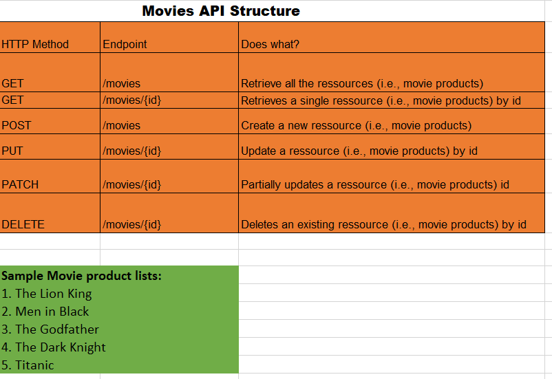

 Movie-node-express

# Rest API with Node and Express

 

My Movie RestAPI structure illustration:

 

In this simple project, I have build a restful API with 'node.js' and 'express.js' web framework for CRUD (Create, Read, Update and Delete) operations.

It is actually a simple Movie-API where all the movies are stored in an array. No persistence layer involved here, meaning once restarted all the added or tested data are not persisted.

Covered concepts:

_ Node and Express to build a web server and REST API

_ Understanding routing, request and response

_ Implementing CRUD with HTTP methods (GET / POST / PUT / UPDATE)

_ Building a server-rendered
